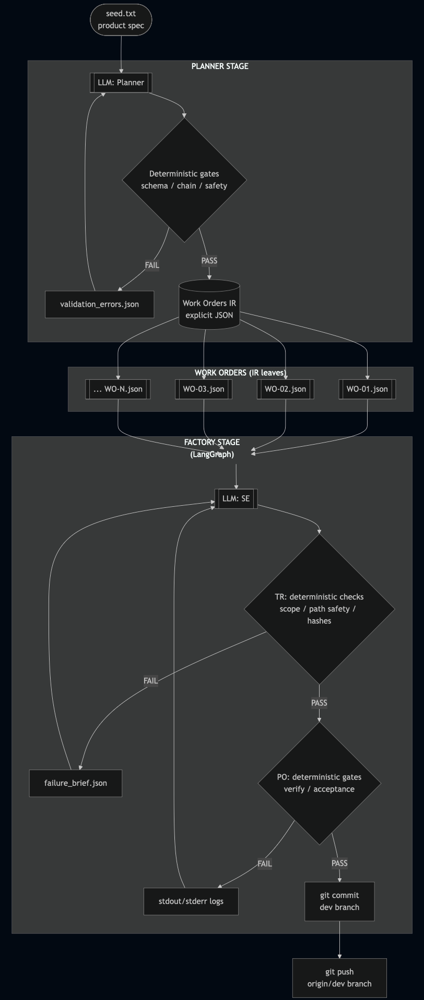

# llm-contract-harness

Structurally enforced work orders for LLM code generation.

An LLM decomposes a product spec into validated work orders (the **planner**). A separate LLM executes each one inside a deterministic enforcement harness that checks scope, hashes, and acceptance tests — and rolls back on failure (the **factory**).

As of today, this harness is designed to build fresh repos from scratch. It is not (yet) an incremental dev tool for existing repos.
---

## TL;DR

**Ultra-lazy demo** (requires Python 3.11+, git, and `OPENAI_API_KEY`):

```bash
export OPENAI_API_KEY=sk-...
make demo
```

This creates a virtualenv, installs the package, sets up a fresh target repo, plans work orders from the example spec, and executes them all. Run `make clean` to remove demo artifacts.

**Manual steps** (same thing, step by step):

```bash
# Install (reproducible — uses pinned versions from requirements.lock)
python -m venv .venv && source .venv/bin/activate
pip install -c requirements.lock -e ".[web]"
cp .env.example .env          # then fill in OPENAI_API_KEY
set -a && source .env && set +a

# Prepare a target repo (must be a git repo with at least one commit)
mkdir my-project && cd my-project && git init && git commit --allow-empty -m init && cd ..

# Plan: turn spec into work orders
llmch plan --spec ./examples/hangman.txt --outdir wo/

# Run all work orders against the repo
llmch run-all --repo my-project --workdir wo/ --branch factory/demo --create-branch

# Or run a single work order
llmch run --repo my-project --work-order wo/WO-01.json --branch factory/demo --create-branch
```

**What happens:** The planner calls an LLM to generate `WO-01.json` through `WO-NN.json` with preconditions, postconditions, file scopes, and acceptance tests — then validates them deterministically. The factory executes each WO: an LLM proposes file writes, deterministic code validates scope and hashes, applies atomic writes, runs verification and acceptance commands, and commits on pass or rolls back on fail. Everything is auditable in `./artifacts/`.

---

## How this repo works (planner → IR → factory)

This is a two-stage pipeline that turns a plain-text product spec into an explicit, human-readable **work-order IR** (JSON), then executes those work orders against a target git repo using a **contract-enforced** LangGraph loop. LLM outputs are *stochastic*; the validation/enforcement gates are *deterministic*.



---

## Detailed Reference

### `llmch plan` — Compile a spec into work orders

Calls the planner LLM (up to 5 attempts with automatic self-correction), validates output against structural checks (E0xx) and cross-work-order chain checks (E1xx), computes `verify_exempt` flags, injects provenance, and writes `WO-*.json` files.

All compile artifacts are written to `./artifacts/planner/{run_id}/`. If `--outdir` is provided, work order files are also exported there.

| Flag | Required | Default | Description |
|------|----------|---------|-------------|
| `--spec` | yes | | Product spec text file |
| `--outdir` | no | *(canonical only)* | Export dir for `WO-*.json` and manifest |
| `--repo` | no | *(empty repo)* | Target repo for precondition validation |
| `--template` | no | `planner/PLANNER_PROMPT.md` | Prompt template path |
| `--artifacts-dir` | no | `./artifacts` | Canonical artifacts root |
| `--overwrite` | no | `false` | Replace existing work orders in outdir |
| `--print-summary` | no | `false` | Print one-line summary per WO |
| `--verbose` | no | `false` | Show timestamps, token counts, full errors |
| `--quiet` | no | `false` | Suppress all output except verdict and errors |
| `--no-color` | no | `false` | Disable colored output |

Exit codes: `0` success, `1` general error, `2` validation error, `3` API/network error, `4` JSON parse error.

### `llmch run` — Execute a single work order

Preflight-checks the git repo, creates or reuses a working branch, runs the SE→TR→PO attempt loop, commits on pass, rolls back on fail.

All run artifacts are written to `./artifacts/factory/{run_id}/`.

| Flag | Required | Default | Description |
|------|----------|---------|-------------|
| `--repo` | yes | | Product git repo (must be clean, ≥1 commit) |
| `--work-order` | yes | | Work order JSON file |
| `--branch` | no | *(auto)* | Working branch name |
| `--create-branch` | no | `false` | Require branch to NOT exist |
| `--reuse-branch` | no | `false` | Require branch to already exist |
| `--max-attempts` | no | `5` | Max SE→TR→PO attempts |
| `--llm-model` | no | `gpt-5.2` | LLM model name |
| `--allow-verify-exempt` | no | `false` | Honor `verify_exempt=true` |
| `--artifacts-dir` | no | `./artifacts` | Canonical artifacts root |
| `--verbose` | no | `false` | Show full error excerpts, baselines, durations |
| `--quiet` | no | `false` | Suppress all output except verdict and errors |
| `--no-color` | no | `false` | Disable colored output |

Advanced flags (passthrough via `--`): `--out`, `--llm-temperature`, `--timeout-seconds`, `--commit-hash`, `--no-push`.

### `llmch run-all` — Execute all work orders sequentially

Discovers `WO-*.json` files in `--workdir`, sorts by WO number, executes each via `llmch run`. First WO creates the branch; subsequent WOs reuse it. Stops on first failure. Extra flags after `--` are forwarded to each factory invocation.

| Flag | Required | Default | Description |
|------|----------|---------|-------------|
| `--repo` | yes | | Product git repo |
| `--workdir` | yes | | Directory containing `WO-*.json` files |
| `--branch` | no | *(auto)* | Working branch name |
| `--create-branch` | no | `false` | Create the branch on first WO |
| `--max-attempts` | no | `5` | Max attempts per WO |
| `--llm-model` | no | `gpt-5.2` | LLM model name |
| `--allow-verify-exempt` | no | `false` | Honor `verify_exempt=true` |
| `--artifacts-dir` | no | `./artifacts` | Canonical artifacts root |

### Artifact layout

```
artifacts/
├── planner/
│   └── {run_id}/
│       ├── run.json
│       ├── compile/
│       │   ├── prompt_attempt_1.txt
│       │   ├── llm_raw_response_attempt_1.txt
│       │   ├── llm_reasoning_attempt_1.txt
│       │   ├── validation_errors_attempt_1.json
│       │   └── ...
│       └── output/
│           ├── WO-01.json ... WO-NN.json
│           └── WORK_ORDERS_MANIFEST.json
└── factory/
    └── {run_id}/
        ├── run.json
        ├── work_order.json
        ├── run_summary.json
        └── attempt_{N}/
            ├── se_prompt.txt
            ├── proposed_writes.json
            ├── write_result.json
            ├── verify_result.json
            ├── acceptance_result.json
            └── failure_brief.json
```

Run directories are immutable (ULID-based, never overwritten). Each `run.json` contains timestamps, config, SHA-256 hashes, and planner↔factory provenance linkage.

### Git workflow

The factory manages branches, commits, and pushes automatically. It never commits to `main` or `master`.

**Branching:** Auto-generated (`factory/{planner_run_id}/{session}`) or explicit (`--branch`). Use `--create-branch` for new sessions, `--reuse-branch` to resume.

**Commit:** On PASS, stages only proposal-touched files (not verification artifacts), commits with `--no-verify`, cleans untracked files, then pushes. Push failures don't change the verdict.

**Rollback:** On FAIL, `git reset --hard` + `git clean -fdx` restores the baseline. Also triggered by `KeyboardInterrupt` via the `BaseException` emergency handler.

### Validation error codes

| Code | Scope | Rule |
|------|-------|------|
| E000 | Structural | Empty/malformed work orders list or non-dict elements |
| E001 | Per-WO | ID format or contiguity violation |
| E003 | Per-WO | Shell operator in acceptance command |
| E004 | Per-WO | Glob character in path |
| E005 | Per-WO | Pydantic schema validation failure |
| E006 | Per-WO | Python syntax error in `python -c` command |
| E007 | Per-WO | Unparseable acceptance command (shlex failure) |
| E101 | Chain | Precondition not satisfiable by cumulative state |
| E102 | Chain | Contradictory preconditions (exists + absent) |
| E103 | Chain | Postcondition path not in `allowed_files` |
| E104 | Chain | `allowed_files` entry has no postcondition |
| E105 | Chain | `bash scripts/verify.sh` in acceptance (banned) |
| E106 | Chain | Verify contract never satisfied by plan |
| W101 | Chain | Acceptance command depends on missing file (warning) |

### Size limits

| Limit | Value |
|-------|-------|
| Max file write | 200 KB per file |
| Max total writes | 500 KB across all files |
| Max context files | 10 per work order |
| Max JSON payload | 10 MB |

### Package layout

```
llmch/                Unified CLI (plan / run / run-all)
planner/              Work-order compiler
  compiler.py         Compile loop: prompt → LLM → validate → revise → emit
  validation.py       Structural + chain validators (E0xx, E1xx)
  openai_client.py    OpenAI Responses API (SSE streaming + polling fallback)
  defaults.py         All planner constants
factory/              Structural enforcement harness
  graph.py            LangGraph state machine (SE → TR → PO → finalize)
  nodes_se.py         SE: precondition gate + LLM call + parse proposal
  nodes_tr.py         TR: scope/hash checks + atomic writes
  nodes_po.py         PO: verify + postconditions + acceptance commands
  schemas.py          Shared Pydantic models (WorkOrder, WriteProposal, etc.)
  workspace.py        Git helpers (branch, commit, rollback, drift detection)
  run.py              CLI orchestration, preflight, verify-exempt policy
  defaults.py         All factory constants
  console.py          Structured terminal output (color, verbosity)
shared/
  run_context.py      ULID generation, SHA-256 helpers, run.json, artifacts root
```

### Security notice

**Acceptance commands run unsandboxed** with the operator's privileges. `shell=False` prevents shell injection but does not sandbox the subprocess. Run inside a disposable container for untrusted workloads.

### Prerequisites

- **Git** on `PATH`. Target repo needs ≥1 commit and a clean working tree.
- **Python ≥3.11** with `pip` and `pytest` available.
- **`OPENAI_API_KEY`** environment variable.
- **HTTPS access** to `api.openai.com`.
- **Sole-writer access** to the target repo (no concurrent modification).
- **Disposable target repo** — the factory runs `git reset --hard` + `git clean -fdx` on failure.

### Guarantees

- **Enforcement is deterministic.** Same LLM output + same repo state = same verdict.
- **LLM non-determinism cannot bypass enforcement.** Scope, hashes, path safety, and acceptance gates are checked after every LLM call.
- **Rollback on any failure** including `KeyboardInterrupt`.
- **Scoped commits** — only proposal-touched files are committed, never verification artifacts.
- **Comprehensive artifact trail** — every attempt is recorded in immutable, ULID-based run directories with SHA-256 provenance.
- **570+ tests** covering enforcement invariants.

### Limitations

- **No semantic correctness guarantee.** The harness validates structure, not intent. The LLM can satisfy all checks with wrong code.
- **No host isolation.** Use a container for untrusted workloads.
- **No crash recovery.** SIGKILL during writes may leave the repo dirty. Preflight blocks the next run; manual `git reset --hard && git clean -fdx` required.
- **No idempotent re-execution.** Re-running a WO calls the LLM again.
- **The `forbidden` field is prompt guidance, not enforcement.** If a file is in both `allowed_files` and `forbidden`, the LLM can write to it.

See [docs/INVARIANTS.md](docs/INVARIANTS.md) for the complete list of enforced system constraints.

---

## Web UI

A single-page web interface that runs the planner→factory pipeline, streams
reasoning live, shows a pipeline node diagram, and lets you browse all
generated artifacts. Completed repos are optionally pushed to a demo GitHub
remote with a unique branch name per run.

### Local development

**Prerequisites:** Python 3.11+, Node.js 20+, npm, git, and `OPENAI_API_KEY`.

```bash
# Install Python dependencies
python -m venv .venv && source .venv/bin/activate
pip install -c requirements.lock -e ".[web]"

# Configure environment
cp .env.example .env   # fill in OPENAI_API_KEY
set -a && source .env && set +a

# Option A: two terminals (hot-reload on both)
python -m web.server.main              # Terminal 1 — backend on :8000
cd web/ui && npm install && npm run dev  # Terminal 2 — Vite on :5173

# Option B: production build (single process)
cd web/ui && npm run build    # outputs to web/ui/dist/
python -m web.server.main     # serves UI + API at http://localhost:8000
```

### AWS deployment

The web app is deployable to **AWS App Runner** via a single CloudFormation
stack that provisions everything automatically:

- **App Runner** — containerised FastAPI + React app (4 vCPU, 8 GB, up to 5 concurrent pipelines)
- **DynamoDB** — run metadata and distributed rate limiting (PAY_PER_REQUEST)
- **S3** — artifact persistence with 30-day lifecycle expiry
- **SSM Parameter Store** — secrets (`OPENAI_API_KEY`, GitHub PAT) stored as SecureString
- **ECR** — Docker image registry

```bash
# One-command deploy (builds, pushes, and deploys)
./infra/deploy.sh
```

The deploy script:
1. Stores secrets in SSM Parameter Store (never on the command line)
2. Builds a `linux/amd64` Docker image and pushes to ECR
3. Deploys/updates the CloudFormation stack (`infra/apprunner.cfn.yaml`)
4. Outputs the public HTTPS URL

The container runs as a non-root user (`llmch`) to limit the blast radius
of LLM-generated code. Git credential URLs are scrubbed from all error
messages before they reach the browser.

**Teardown:**

```bash
aws cloudformation delete-stack --stack-name llmch-demo --region us-east-1
```

See `INSTRUCTIONS.md` for a detailed deployment walkthrough.

### Environment variables

| Variable | Default | Description |
|----------|---------|-------------|
| `OPENAI_API_KEY` | *(required)* | OpenAI API key |
| `LLMCH_HOST` | `127.0.0.1` | Backend bind address (`0.0.0.0` in production) |
| `LLMCH_PORT` | `8000` | Backend bind port |
| `LLMCH_ARTIFACTS_DIR` | `./artifacts` | Artifacts root (`/tmp/artifacts` on App Runner) |
| `LLMCH_DEMO_REMOTE_URL` | *(none)* | Git remote URL for demo push (HTTPS) |
| `LLMCH_DEMO_REMOTE_TOKEN` | *(none)* | GitHub PAT for push authentication |
| `LLMCH_RATE_LIMIT_PER_IP` | `100` | Max pipeline runs per IP per day |
| `LLMCH_RATE_LIMIT_GLOBAL` | `100` | Max pipeline runs globally per day |
| `LLMCH_DYNAMO_TABLE` | *(none)* | DynamoDB table name (enables distributed storage) |
| `LLMCH_S3_BUCKET` | *(none)* | S3 bucket name (enables artifact upload) |
| `LLMCH_SKIP_REPO_VENV` | `0` | Set to `1` in Docker (pytest pre-installed) |

---

## Security & Limitations

This project is a **solo-developer demo** designed for a public LinkedIn audience.
The following trade-offs are intentional and documented here for transparency.

### Execution sandbox

Verify and acceptance commands (e.g. `python -m pytest`) run with the server
process's privileges. The Docker container runs as a non-root user (`llmch`)
which limits the blast radius, but there is no network isolation, filesystem
jail, or cgroup/seccomp restriction. LLM-generated code can make outbound HTTP
calls or read non-secret environment variables.

*Why this is acceptable*: the demo runs on a single disposable instance.
Enterprise sandboxing (nsjail, Firecracker, gVisor) is out of scope for a
solo-dev proof of concept.

### Arbitrary user prompts

The UI accepts free-text prompts which drive LLM code generation. There are no
content filters on the prompt itself (prompt length is capped at 10,000 characters).
The structural enforcement gates (preconditions, postconditions, acceptance
tests, file-scope checks, hash verification) constrain what the LLM *can
successfully commit*, but the LLM can still *attempt* arbitrary code during
verify/acceptance execution.

### Rate limiting

- IP-based daily limits (configurable via `LLMCH_RATE_LIMIT_PER_IP`).
- Global daily limit (configurable via `LLMCH_RATE_LIMIT_GLOBAL`).
- Backed by DynamoDB when `LLMCH_DYNAMO_TABLE` is set (atomic
  `ConditionExpression`-based enforcement), otherwise local SQLite.
- IP extracted from `X-Forwarded-For` (proxy-appended, not client-set).

### Concurrency

Up to 5 pipelines run concurrently (enforced by a semaphore in `LocalRunner`).
Submitting beyond the limit returns HTTP 429. The App Runner service is pinned
to a single instance to keep SSE streaming and local artifacts consistent.

### Secrets

- `OPENAI_API_KEY` is read from the environment and never written to artifacts,
  event logs, or API responses.
- On AWS, secrets are stored in SSM Parameter Store (SecureString) and injected
  via App Runner's `RuntimeEnvironmentSecrets` — never passed as CloudFormation
  parameters or command-line arguments.
- Git push credential URLs are scrubbed from all error messages before they
  reach the browser via SSE.
- The `.env` file is gitignored. See `.env.example` for the full variable list.

### Artifact storage

Run data is stored locally under `artifacts/` during pipeline execution.
When `LLMCH_S3_BUCKET` is set, artifacts are uploaded to S3 after each run
for durability. The S3 bucket is configured with explicit public access
blocking, AES256 encryption, and a 30-day lifecycle expiry. Run metadata is
persisted to DynamoDB when `LLMCH_DYNAMO_TABLE` is set.
